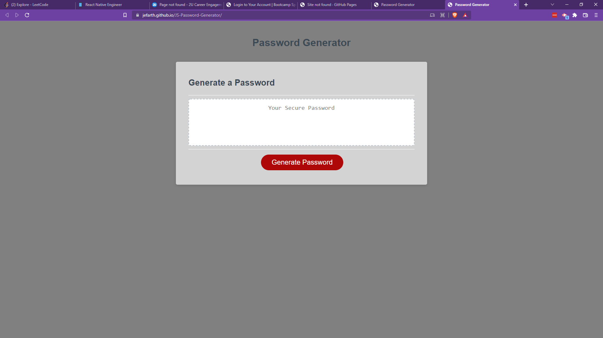
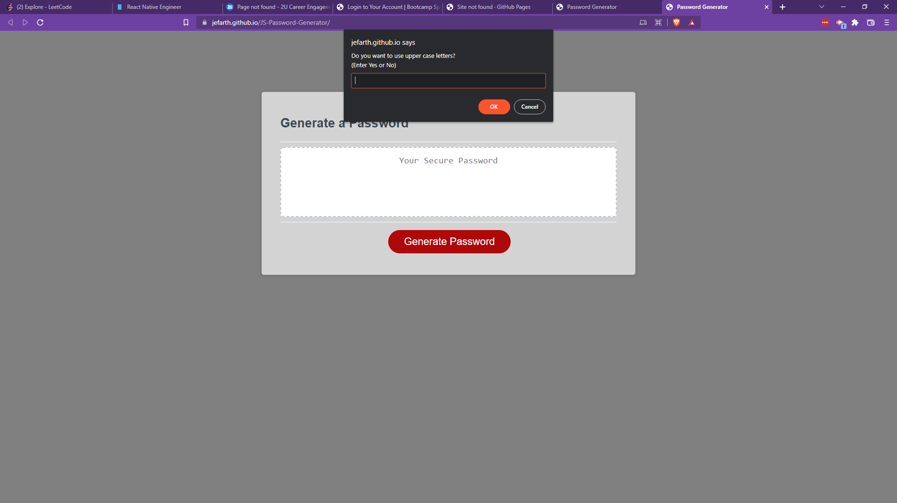

# JavaScript Password Generator
  

  ## Description
  This is an application that a user can use to generate a random secure password from a variety of chosen criteria. Encouraged for use when working with sensitive data that should be protected.

  
  
  

  ## Table of Contents 

  * [Installation](#installation)
  * [Usage](#usage)
  * [License](#license)
  * [Contributions](#contributions)
  * [Tests](#tests)
  * [Questions](#questions)

  ## Installation
  Follow these steps to install the application: To install this project, first create a new repository on your local machine. Navigate to GitHub and find the "Code" button. Click on it and select "SSH" within the drop down menu. Copy the SSH key. Open up a new terminal inside the new repository you created and write "git clone". Paste the SSH key in after and hit enter.

  ## Usage
  To use this application: This project can be found live here for use: [JS-Password-Generator](https://jefarth.github.io/JS-Password-Generator/). After it is open, follow the instructed prompts to generate your password.

  ## License
  This project is licensed under: MIT License.

  ## Contributions
  Contributions made by: I created all of the JavaScript to get this application to run, aside from the writePassword() function with the correlating event listeners. 

  ## Tests
  Testing on this application was performed by: The test operation for this project was primarily using console.log()'s to see my data values as well as when and where it is firing. This was accomplished by refreshing the page to see any changes made.

  ## Questions
  If you have any questions about the application, please contact "jefarth" directly at jefarth.dev@gmail.com